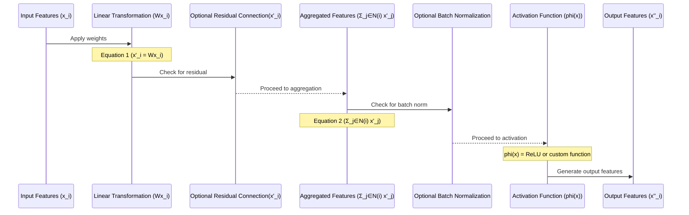
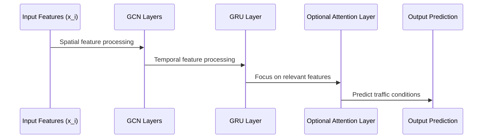
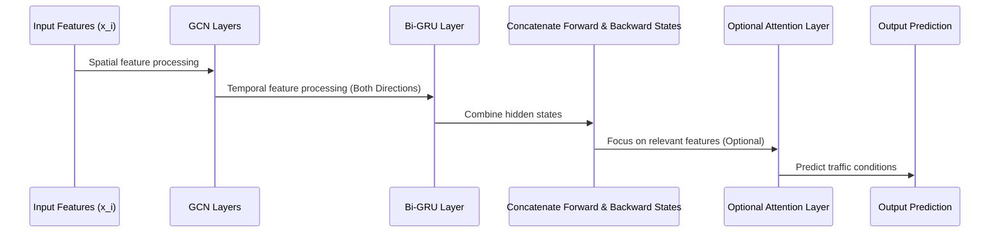
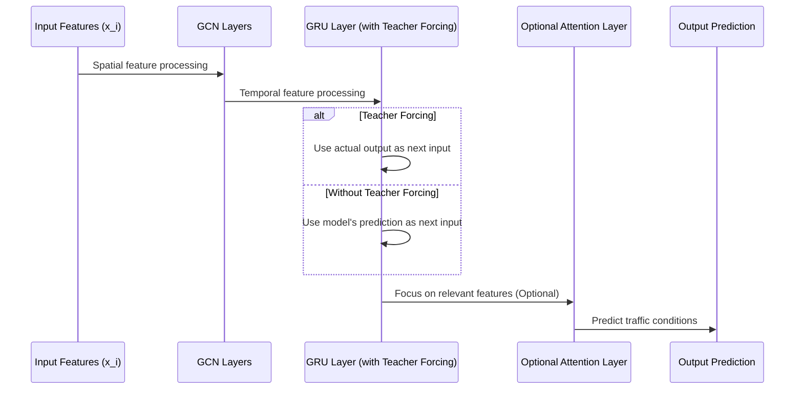
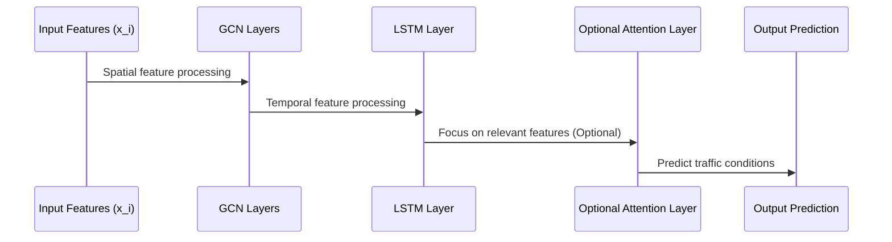
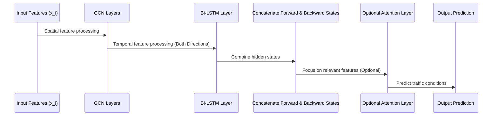
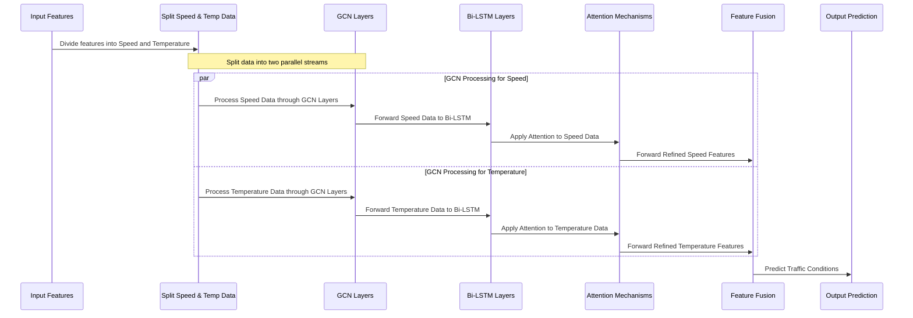

# Spatio-Temporal Graph Convolutional Network (ST-GCN)
Base models for graph convolutional networks. Information on data preperation can be found in the [Adjacency Matrix](https://github.com/TrafficGCN/haversine_mapping_for_spatial_integration_in_graph_convolutional_networks) and [Haversine Mapping](https://github.com/TrafficGCN/haversine_mapping_for_spatial_integration_in_graph_convolutional_networks) repositories.

## Citations

1. For the Los Angeles metr-la and Santa Clara pems-bay datasets cite: Kwak, Semin. (2020). PEMS-BAY and METR-LA in csv [Data set]. Zenodo. https://doi.org/10.5281/zenodo.5146275

2. Weather sensors are provided by University of Utah Department of Atmospheric Sciences https://mesowest.utah.edu/

3. Bicycle sensors from the City of Munich Opendata Portal: https://opendata.muenchen.de/dataset/raddauerzaehlstellen-muenchen/resource/211e882d-fadd-468a-bf8a-0014ae65a393?view_id=11a47d6c-0bc1-4bfa-93ea-126089b59c3d

4. OpenStreetMap https://www.openstreetmap.org/ must also be referenced because the matrices where calculated using OpenStreetMap.

5. If you use any of the Maps you must reference both OpenStreetMap and Mapbox https://www.mapbox.com/.

6. For Shenzhen cite: https://github.com/lehaifeng/T-GCN

## Traffic Prediction Models

### GCN_CONV

The `GCN_CONV` model represents a sophisticated adaptation of graph convolutional networks (GCNs), aimed at efficiently capturing spatial relationships within graph-structured data. This custom layer is an integral part of our traffic prediction models, enabling the incorporation of spatial dependencies into the predictive analytics framework. Its design is based on extending the `MessagePassing` class from the PyTorch Geometric (PyG) library, which provides a flexible and powerful foundation for implementing graph neural networks (GNNs).

#### Theoretical Background

Graph convolutional networks generalize convolutional neural networks (CNNs) to graph-structured data, allowing for the processing of non-Euclidean domains. The core principle behind GCNs is to update a node's feature representation by aggregating feature information from its neighbors. This process, often referred to as message passing, enables the capture of local graph topology within node features.

#### Message Passing Mechanism

The `GCN_CONV` model implements a message passing mechanism where messages (features) from neighboring nodes are aggregated to update each node's features. The process can be formally described by the following steps:

1. **Linear Transformation**: A linear transformation is applied to node features to project them into a higher-dimensional space, facilitating the learning of complex patterns. This is mathematically represented as:
   - 
   where \(x_i\) is the feature vector of node \(i\), \(W\) is the weight matrix of the linear transformation, and \(x'_i\) is the transformed feature vector.

2. **Aggregation**: The transformed features of the neighbors are aggregated using a sum operation. This step can incorporate edge weights to modulate the influence of different neighbors, enhancing the model's adaptability to various graph structures.
   - %7D%20x%27_j)
   where \(N(i)\) denotes the set of neighbors of node \(i\), and \(x''_i\) represents the aggregated feature vector.

3. **ReLU Function**
The ReLU (Rectified Linear Unit) function is used as an activation function in neural networks. It introduces non-linearity to the model, allowing it to learn more complex patterns. The function outputs the input directly if it is positive; otherwise, it outputs zero.
   - %20=%20\max(0,%20x))

4. **`self.activation` Attribute**
The `self.activation` attribute in the `GCN_CONV` class specifies the activation function to be used in the neural network layer. If a specific activation function is provided during the instantiation of the class, it is used; otherwise, the default ReLU function is applied. This operation is applied after the linear transformation and aggregation steps to introduce non-linearity into the model.
   - )


Consider we have a network of traffic sensors placed at various points on roads. Each sensor can communicate with its neighboring sensors to share and update information about traffic conditions like speed flow or density. This information is sent over the network graph to create an aggregated understanding of the conditions.




#### Batch Normalization and Activation

Following aggregation, optional batch normalization can be applied to stabilize learning and improve convergence. An activation function, typically ReLU, introduces non-linearities into the model, enabling it to capture complex relationships in the data.

#### Residual Connections

The model supports residual connections, where the input features are added to the output of the activation function. This design choice is crucial for training deeper models by alleviating the vanishing gradient problem and facilitating the learning of identity mappings.

#### Practical Implementation

Implemented using PyTorch and PyTorch Geometric, the `GCN_CONV` model benefits from efficient computation and ease of integration with other neural network components. Its design is modular, allowing for easy customization of features such as the activation function, the use of batch normalization, and the inclusion of residual connections to suit specific requirements.

#### Use in Traffic Prediction

In the context of traffic prediction, the `GCN_CONV` model enables the effective incorporation of spatial data, such as road networks, into the forecasting framework. By modeling traffic networks as graphs, where nodes represent intersections or segments of interest and edges capture the connectivity and relationships between these points, the `GCN_CONV` layer updates traffic state predictions based on both the current state and the spatial context provided by the surrounding network structure.

#

### ARIMA_NN
- **Path**: `models.ARIMA_NN.ARIMA_NN`
- **Description**: Combines the ARIMA model with neural networks to capture both linear and non-linear patterns in traffic data. It is designed for univariate time series forecasting.
- **Parameters**:
  - `hidden_channels`: 1
  - `p`: 5
  - `d`: 1
  - `q`: 0

#

### GCN_GRU
- **Path**: `models.GCN_GRU.GCN_GRU`
- **Description**: Leverages Graph Convolutional Networks (GCN) and Gated Recurrent Unit (GRU) for spatial-temporal traffic forecasting. It captures the spatial dependencies through GCN and temporal dynamics through GRU layers.
- **Parameters**:
  - `in_channels`: None
  - `hidden_channels`: 32
  - `num_gcn_layers`: 16
  - `num_rnn_layers`: 3
  - `dropout`: 0

#### GCN_GRU Model Overview

The `GCN_GRU` model adeptly combines Graph Convolutional Networks (GCNs) for spatial feature extraction with Gated Recurrent Units (GRUs) for capturing temporal dynamics in the traffic data.

#### Spatial Feature Processing with GCN Layers

Spatial features within the graph are processed through GCN layers, described by:

- **GCN Layer Equation**:
  }%20=%20\sigma(\tilde{B}%20\tilde{D}^{-1}%20\tilde{A}%20H^{(l)}%20W^{(l)}))

  Where:
  - `H^{(l)}`: node features matrix at layer `l`,
  - `Ã`: adjacency matrix with self-loops,
  - `D̃`: diagonal node degree matrix,
  - `W^{(l)}`: weight matrix at layer `l`,
  - `σ`: non-linear activation function (ReLU),
  - `B̃`: normalization coefficient matrix,
  - `h^{(l+1)}`: node features for the next layer.

Batch normalization and dropout applied post-GCN layer enhance regularization:

- **Batch Normalization**: Standardizes features to zero mean and unit variance.
- **Dropout**: Mitigates overfitting by randomly omitting features with probability `p`.

#### Temporal Feature Processing with GRU Layer

Temporal dynamics are modeled using a GRU layer:

- **GRU Equation**:
  %20=%20GRU(h_t,%20h_{t-1}))

  Where `h_t` is the hidden state at time `t`, updated by the GRU function based on the previous state and current input.

#### Optional Attention Mechanism

The attention mechanism refines focus on pertinent temporal features:

- **Attention Equation**:
  ))

  Where `α_t` denotes the attention weight for time `t`, with `W_h`, `b`, and `v^T` as learnable parameters, ensuring attention weights sum to 1 across all time steps.

#### Output Prediction

Output predictions are generated through linear transformation:

- **Output Layer Equation**:
  

  Here, `y` represents the output prediction, with `W_o` and `b_o` being the weight and bias of the output layer, respectively, and `h_t` is the final hidden state or attention-weighted feature representation.

This model's integrated approach to spatial and temporal processing empowers it to predict complex patterns in graph-structured time-series data effectively.



This sequential workflow allows the `GCN_GRU` model to leverage both the spatial layout of the traffic sensor network and the temporal evolution of traffic conditions, offering a comprehensive approach to traffic prediction.

#

### GCN_GRU_BI
- **Path**: `models.GCN_GRU_BI.GCN_GRU_BI`
- **Description**: Extends the GCN_GRU model by introducing bidirectional GRU layers, enhancing its ability to understand complex temporal relationships in traffic data.
- **Parameters**:
  - Same as GCN_GRU

#### GCN_GRU_BI Model Overview

The `GCN_GRU_BI` model enhances the `GCN_GRU` architecture by integrating a Bidirectional Gated Recurrent Unit (Bi-GRU) for temporal feature processing. This modification aims to capture temporal dependencies in both directions along the time axis, offering a more nuanced understanding of traffic conditions in sensor networks.

#### Bidirectional Temporal Feature Processing

- **Bidirectional GRU (Bi-GRU) Layer**: The key difference in `GCN_GRU_BI` is the use of a bidirectional GRU layer, which processes the temporal sequence in both forward and backward directions. This is mathematically represented by:
  - Forward Pass: 
  - Backward Pass: 
  - Where \(x_t\) is the input at time step \(t\), \(\overrightarrow{h_t}\) is the forward hidden state, and \(\overleftarrow{h_t}\) is the backward hidden state.

- **Enhanced Temporal Understanding**: By analyzing traffic data from both past and future contexts, the Bi-GRU layer provides a richer feature set for each time step, potentially improving the model's predictive accuracy for traffic speed and density.

#### Output Layer Adaptation

- **Adapted Output Layer**: Due to the bidirectional nature of the GRU, the output feature size is doubled, as it concatenates the forward and backward hidden states. Consequently, the output layer's input size is adjusted to accommodate this:
  - 
  - Where  represents the concatenation of the forward and backward hidden states at time step \(t\), \(W_o\) is the weight matrix of the output layer, \(b_o\) is the bias, and \(y\) is the output prediction.

#### Model Architecture Summary

- **Spatial Feature Extraction**: Similar to `GCN_GRU`, spatial features are extracted using a series of GCN layers, each followed by batch normalization and dropout for regularization.
- **Temporal Feature Extraction**: The bidirectional GRU layer provides a comprehensive temporal analysis, enhancing the model's ability to capture traffic dynamics.
- **Output Prediction**: The adapted output layer generates predictions for traffic conditions, such as vehicle speed flow and density, at each sensor node, leveraging the enriched feature representation provided by the Bi-GRU layer.

This bidirectional approach ensures that the `GCN_GRU_BI` model can effectively utilize the full temporal context of the traffic data, making it particularly well-suited for applications in traffic forecasting where both historical trends and future predictions are vital.



#

### GCN_GRU_TeacherForcing
- **Path**: `models.GCN_GRU_TeacherForcing.GCN_GRU_TeacherForcing`
- **Description**: Adopts teacher forcing in training the GCN_GRU model, leading to faster convergence and improved model performance by using the true past output as input.
- **Parameters**:
  - Same as GCN_GRU


#### GCN_GRU_TeacherForcing Model Overview

The `GCN_GRU_TeacherForcing` model enhances the `GCN_GRU` framework by integrating the teacher forcing technique during the training phase. In the case of traffic prediction models like the GCN_GRU_TeacherForcing model, the ground truth might consist of the actual recorded traffic speeds and densities at various times and locations, against which the model's predictions of traffic conditions are compared to assess accuracy.

#### Teacher Forcing Mechanism

- **Teacher Forcing Concept**: During training, teacher forcing uses the ground truth from the previous time step as the input for the next time step, instead of the model's own predictions. This method is represented by the conditional use of target values:
  - With Teacher Forcing: .If the decision is to use teacher forcing (determined randomly based on the teacher_forcing_ratio), the model uses the actual output from the data ```(target[:, i].unsqueeze(1))``` as the input for the next time step in the sequence. This exposes the model to the correct sequence context, potentially speeding up learning and improving accuracy by providing exact, real-world information.
  - Without Teacher Forcing: 
  where \(\text{target}_t\) is the actual output at time \(t\), and \(\hat{y}_t\) is the model's prediction at time \(t\). If not using teacher forcing, the model uses its own prediction from the previous step as the input for the next step. This mode encourages the model to learn to generate sequences autonomously, relying on its internal predictions to proceed.

- **Teacher Forcing Ratio**: The `teacher_forcing_ratio` parameter controls the frequency of teacher forcing use during training, allowing for a blend of guided and autonomous learning. This ratio is a hyperparameter that can be adjusted to optimize training performance.

#### Training with Teacher Forcing

- During training, if `target` is provided and the model is in training mode, a random decision is made on whether to apply teacher forcing based on the `teacher_forcing_ratio`.
- If teacher forcing is applied, the model uses the actual target sequence for the next input; otherwise, it uses its own predictions from the previous time step.
- This technique can lead to faster convergence and improved model accuracy by directly exposing the model to the correct sequence context during training.

#### Model Architecture Summary

- **Spatial Feature Extraction**: Identical to `GCN_GRU`, utilizing GCN layers followed by batch normalization and dropout for regularizing spatial feature processing.
- **Temporal Feature Processing**: Employs a GRU layer for temporal dynamics modeling, with the addition of teacher forcing to enhance sequence prediction accuracy.
- **Output Prediction**: Generates predictions for traffic conditions using the processed features, with the output layer adapted for sequential data generation.

The inclusion of teacher forcing in `GCN_GRU_TeacherForcing` offers a powerful technique for improving the predictive capabilities of the model in traffic forecasting applications.




#

### GCN_LSTM
- **Path**: `models.GCN_LSTM.GCN_LSTM`
- **Description**: Integrates GCN with Long Short-Term Memory (LSTM) networks, aiming to exploit both spatial dependencies and long-term temporal patterns in traffic data.
- **Parameters**:
  - Same as GCN_GRU

#### GCN_LSTM Model Overview

The `GCN_LSTM` model integrates Graph Convolutional Networks (GCNs) with Long Short-Term Memory (LSTM) networks, forming a powerful architecture for analyzing graph-structured time-series data. This model performs marginally better than the `GCN_GRU`.

#### Key Differences from GCN_GRU

- **LSTM for Temporal Processing**: Unlike the `GCN_GRU` model, which utilizes GRU layers for temporal dynamics, `GCN_LSTM` employs LSTM layers. LSTMs are renowned for their ability to learn long-term dependencies, thanks to their internal gating mechanism:
  - The LSTM unit includes three gates (input, forget, and output gates) that control the flow of information, allowing the network to remember and forget information over long sequences.
  - 
  - where \(f_t\), \(i_t\), and \(o_t\) are the forget, input, and output gates, respectively; \(\tilde{C_t}\) is the candidate cell state; \(C_t\) is the cell state; \(h_t\) is the output hidden state; \(x_t\) is the input at time \(t\); and \(W\) and \(b\) represent weights and biases for each gate.

#### Spatial Feature Extraction with GCNs

- Similar to `GCN_GRU`, the model employs multiple GCN layers for spatial feature extraction, with each layer followed by batch normalization and dropout to enhance learning efficacy and generalization.

#### Temporal Feature Extraction with LSTM

- The LSTM layer(s) process the spatially enhanced features to capture temporal dependencies, utilizing the LSTM's gating mechanism to effectively manage information over long sequences.

#### Optional Attention Mechanism

- An optional attention layer can be employed to refine the model's focus on significant temporal features, potentially enhancing prediction accuracy by allowing the model to prioritize the most informative parts of the sequence.

#### Model Architecture Summary

- **Spatial Feature Processing**: The model utilizes GCN layers for extracting spatial features from graph-structured data, capturing the relationships and interactions between nodes (e.g., traffic sensors).
- **Temporal Feature Processing**: LSTM layers are used for modeling temporal dynamics, offering advantages in learning long-term dependencies within the data.
- **Output Prediction**: The final predictions, such as traffic speed and density, are generated by passing the processed features through an output linear layer.

This architecture makes the `GCN_LSTM` model particularly well-suited for forecasting tasks in traffic sensor networks, leveraging both the spatial layout of the network and the historical trends in traffic conditions for accurate predictions.



#

### GCN_LSTM_BI
- **Path**: `models.GCN_LSTM_BI.GCN_LSTM_BI`
- **Description**: Enhances the GCN_LSTM model by incorporating bidirectional LSTM layers, offering a more comprehensive analysis of temporal sequences.
- **Parameters**:
  - Same as GCN_LSTM


#### GCN_LSTM_BI Model Overview

The `GCN_LSTM_BI` model enhances the `GCN_LSTM` architecture by integrating a Bidirectional Long Short-Term Memory (Bi-LSTM) network for temporal feature processing. This bidirectional approach enables the model to capture temporal relationships in both forward and backward directions across time, providing a more nuanced understanding of sequences in traffic forecasting applications.

#### Key Differences from GCN_LSTM

- **Bidirectional LSTM (Bi-LSTM) Layer**: The primary distinction of `GCN_LSTM_BI` lies in its use of a Bi-LSTM layer, which processes temporal sequences from both directions. This dual processing path allows the model to learn from past and future contexts simultaneously, enhancing its predictive capabilities for complex temporal patterns.
  - The Bi-LSTM mechanism is mathematically represented as follows:
    - Forward Pass: 
    - Backward Pass: 
    - where \(x_t\) is the input at time step \(t\), \(\overrightarrow{h_t}\) and \(\overleftarrow{h_t}\) are the hidden states from the forward and backward passes, respectively.

- **Output Layer Adaptation**: Due to the bidirectional nature of the LSTM, the output dimensionality is doubled, as it concatenates the forward and backward hidden states. Thus, the model's output layer is adapted to handle this increased feature size, enhancing its ability to utilize the rich temporal information provided by the Bi-LSTM.
  - The output layer equation is adjusted to accommodate bidirectional outputs: 
    - where  represents the concatenation of the forward and backward hidden states, \(W_o\) is the output layer's weight matrix, \(b_o\) is the bias term, and \(y\) is the predicted output.

#### Model Architecture Summary

- **Spatial Feature Extraction**: Utilizes a series of GCN layers for extracting spatial features from the graph-structured data, capturing the complex relationships between nodes (e.g., traffic sensors) within the network.
- **Temporal Feature Extraction**: Employs a Bi-LSTM layer to model the temporal dynamics of the data, benefiting from the ability to consider both past and future context for each time step.
- **Output Prediction**: Generates predictions for traffic conditions, such as vehicle speed flow and density, leveraging the enriched spatial-temporal feature representation produced by the combined GCN and Bi-LSTM layers.

This bidirectional approach ensures that `GCN_LSTM_BI` can effectively leverage the full temporal context of traffic data, making it particularly suitable for traffic forecasting tasks where both historical trends and anticipatory insights are crucial for accurate predictions.



#

### GCN_LSTM_BI_Multi_Attention_Weather
- **Path**: `models.GCN_LSTM_BI_Multi_Attention_Weather.GCN_LSTM_BI_Multi_Attention_Weather`
- **Description**: Incorporates weather data into the GCN_LSTM_BI_Multi_Attention model, acknowledging the impact of weather conditions on traffic patterns to improve forecasting accuracy.
- **Parameters**:
  - `in_channels`: None
  - `hidden_channels`: 64
  - `num_gcn_layers`: 64
  - `


#### GCN_LSTM_BI_Multi_Attention_Weather_Separate Model Overview

The `GCN_LSTM_BI_Multi_Attention_Weather_Separate` model leverages graph convolutional networks (GCNs) and bidirectional Long Short-Term Memory (Bi-LSTM) networks, enhanced with multiple attention mechanisms, to analyze graph-structured time-series data. This model is uniquely designed to process traffic speed data and air temperature data separately, recognizing the impact of weather conditions on traffic dynamics. It aims to improve traffic forecasting by incorporating both spatial relationships and temporal patterns, along with the influence of weather variables.

#### Key Features

- **Separate Processing Pathways**: The model features distinct processing pathways for traffic speed and air temperature data, each consisting of GCN layers for spatial feature extraction followed by Bi-LSTM layers for temporal dynamics modeling. This dual-pathway approach allows the model to capture the nuanced effects of weather on traffic conditions independently before fusing the information.
  - Spatial feature extraction: }%20=%20\sigma(\tilde{D}^{-\frac{1}{2}}\tilde{A}\tilde{D}^{-\frac{1}{2}}H^{(l)}W^{(l)}))
  - Temporal dynamics with Bi-LSTM: )

- **Multi-Attention Mechanisms**: Post-processing, the model employs multiple attention mechanisms to refine its focus on the most predictive features. This includes separate attention layers for speed and temperature data and a spatio-temporal attention layer that combines and weights features across both spatial and temporal dimensions.
  - Attention for feature refinement: )
  - Spatio-temporal attention to leverage spatial neighbors and temporal lags: 

- **Fusion and Output**: The separately processed and attention-refined features from the speed and temperature pathways are fused to generate a comprehensive set of features, which are then used to predict traffic conditions, accounting for the influence of weather.


- **Fusion and Output**: After processing the traffic speed and air temperature data through their respective pathways, including GCN layers, Bi-LSTM layers, and attention mechanisms, the model fuses these refined features to create a comprehensive representation that accounts for both traffic conditions and environmental factors.

    

    Where  represents the fused feature set,  denotes the attention-refined features from the speed pathway, and  denotes the attention-refined features from the temperature pathway. The Concat operation concatenates these feature sets along the feature dimension.

- The fused features are then passed through an output layer to generate the final traffic condition predictions.

    

    Where  is the vector of predicted traffic conditions (e.g., speed and density),  is the weight matrix of the output layer,  is the fused feature set from both the speed and temperature data streams, and  is the bias term.




#### Model Architecture Summary

The `GCN_LSTM_BI_Multi_Attention_Weather_Separate` model's architecture is meticulously designed to handle the complexities of predicting traffic conditions influenced by weather. By processing traffic speed and air temperature data through separate but parallel pathways, and applying both attention and spatio-temporal attention mechanisms, the model aims to provide accurate, weather-informed traffic forecasts.


## Sensor Predictions


<br />
<br />
<br />
<br />
<br />
<br />
<br />
<br />
<br />
<br />
<br />
<br />
<br />
<br />
<br />
<br />
<br />

## Graph CFD Error Distribution


<br />
<br />
<br />
<br />
<br />
<br />
<br />
<br />


