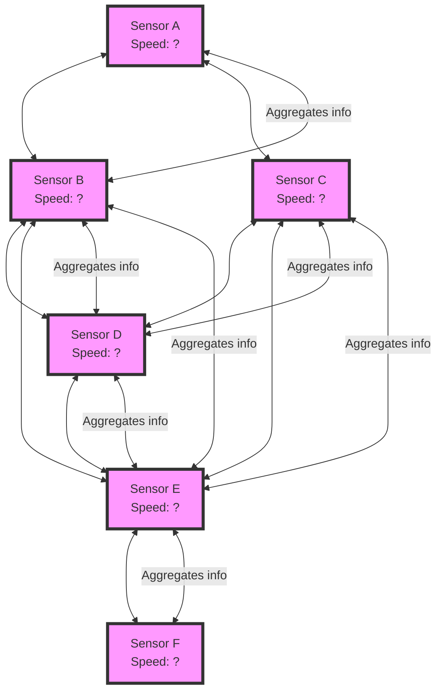

# Spatio-Temporal Graph Convolutional Network (ST-GCN)
Base models for graph convolutional networks.

### Citations

1. For the Los Angeles metr-la and Santa Clara pems-bay datasets cite: Kwak, Semin. (2020). PEMS-BAY and METR-LA in csv [Data set]. Zenodo. https://doi.org/10.5281/zenodo.5146275

2. Weather sensors are provided by University of Utah Department of Atmospheric Sciences https://mesowest.utah.edu/

3. Bicycle sensors from the City of Munich Opendata Portal: https://opendata.muenchen.de/dataset/raddauerzaehlstellen-muenchen/resource/211e882d-fadd-468a-bf8a-0014ae65a393?view_id=11a47d6c-0bc1-4bfa-93ea-126089b59c3d

4. OpenStreetMap https://www.openstreetmap.org/ must also be referenced because the matrices where calculated using OpenStreetMap.

5. If you use any of the Maps you must reference both OpenStreetMap and Mapbox https://www.mapbox.com/.

6. For Shenzhen cite: https://github.com/lehaifeng/T-GCN

### Traffic Prediction Models

#### GCN_CONV Model Detailed Overview

The `GCN_CONV` model represents a sophisticated adaptation of graph convolutional networks (GCNs), aimed at efficiently capturing spatial relationships within graph-structured data. This custom layer is an integral part of our traffic prediction models, enabling the incorporation of spatial dependencies into the predictive analytics framework. Its design is based on extending the `MessagePassing` class from the PyTorch Geometric (PyG) library, which provides a flexible and powerful foundation for implementing graph neural networks (GNNs).

##### Theoretical Background

Graph convolutional networks generalize convolutional neural networks (CNNs) to graph-structured data, allowing for the processing of non-Euclidean domains. The core principle behind GCNs is to update a node's feature representation by aggregating feature information from its neighbors. This process, often referred to as message passing, enables the capture of local graph topology within node features.

##### Message Passing Mechanism

The `GCN_CONV` model implements a message passing mechanism where messages (features) from neighboring nodes are aggregated to update each node's features. The process can be formally described by the following steps:

1. **Linear Transformation**: A linear transformation is applied to node features to project them into a higher-dimensional space, facilitating the learning of complex patterns. This is mathematically represented as:
   - 
   where \(x_i\) is the feature vector of node \(i\), \(W\) is the weight matrix of the linear transformation, and \(x'_i\) is the transformed feature vector.

2. **Aggregation**: The transformed features of the neighbors are aggregated using a sum operation. This step can incorporate edge weights to modulate the influence of different neighbors, enhancing the model's adaptability to various graph structures.
   - %7D%20x%27_j)
   where \(N(i)\) denotes the set of neighbors of node \(i\), and \(x''_i\) represents the aggregated feature vector.

Consider we have a network of traffic sensors placed at various points on roads. Each sensor can communicate with its neighboring sensors to share and update information about traffic conditions like speed flow or density. This information is sent over the network graph to create an aggregated understanding of the conditions.

##### Batch Normalization and Activation

Following aggregation, optional batch normalization can be applied to stabilize learning and improve convergence. An activation function, typically ReLU, introduces non-linearities into the model, enabling it to capture complex relationships in the data.

##### Residual Connections

The model supports residual connections, where the input features are added to the output of the activation function. This design choice is crucial for training deeper models by alleviating the vanishing gradient problem and facilitating the learning of identity mappings.

##### Practical Implementation

Implemented using PyTorch and PyTorch Geometric, the `GCN_CONV` model benefits from efficient computation and ease of integration with other neural network components. Its design is modular, allowing for easy customization of features such as the activation function, the use of batch normalization, and the inclusion of residual connections to suit specific requirements.

##### Use in Traffic Prediction

In the context of traffic prediction, the `GCN_CONV` model enables the effective incorporation of spatial data, such as road networks, into the forecasting framework. By modeling traffic networks as graphs, where nodes represent intersections or segments of interest and edges capture the connectivity and relationships between these points, the `GCN_CONV` layer updates traffic state predictions based on both the current state and the spatial context provided by the surrounding network structure.

#### ARIMA_NN
- **Path**: `models.ARIMA_NN.ARIMA_NN`
- **Description**: Combines the ARIMA model with neural networks to capture both linear and non-linear patterns in traffic data. It is designed for univariate time series forecasting.
- **Parameters**:
  - `hidden_channels`: 1
  - `p`: 5
  - `d`: 1
  - `q`: 0

#### GCN_GRU
- **Path**: `models.GCN_GRU.GCN_GRU`
- **Description**: Leverages Graph Convolutional Networks (GCN) and Gated Recurrent Unit (GRU) for spatial-temporal traffic forecasting. It captures the spatial dependencies through GCN and temporal dynamics through GRU layers.
- **Parameters**:
  - `in_channels`: None
  - `hidden_channels`: 32
  - `num_gcn_layers`: 16
  - `num_rnn_layers`: 3
  - `dropout`: 0

#### GCN_GRU_BI
- **Path**: `models.GCN_GRU_BI.GCN_GRU_BI`
- **Description**: Extends the GCN_GRU model by introducing bidirectional GRU layers, enhancing its ability to understand complex temporal relationships in traffic data.
- **Parameters**:
  - Same as GCN_GRU

#### GCN_GRU_BI_Attention
- **Path**: `models.GCN_GRU_BI_Attention.GCN_GRU_BI_Attention`
- **Description**: Incorporates attention mechanisms into the GCN_GRU_BI model, allowing it to focus on critical temporal intervals for improved prediction accuracy.
- **Parameters**:
  - Same as GCN_GRU_BI

#### GCN_GRU_BI_Multi_Attention
- **Path**: `models.GCN_GRU_BI_Multi_Attention.GCN_GRU_BI_Multi_Attention`
- **Description**: Builds upon the GCN_GRU_BI_Attention model by adding multiple attention layers, further refining the model's focus on significant temporal features.
- **Parameters**:
  - Same as GCN_GRU_BI_Attention

#### GCN_GRU_TeacherForcing
- **Path**: `models.GCN_GRU_TeacherForcing.GCN_GRU_TeacherForcing`
- **Description**: Adopts teacher forcing in training the GCN_GRU model, leading to faster convergence and improved model performance by using the true past output as input.
- **Parameters**:
  - Same as GCN_GRU

#### GCN_LSTM
- **Path**: `models.GCN_LSTM.GCN_LSTM`
- **Description**: Integrates GCN with Long Short-Term Memory (LSTM) networks, aiming to exploit both spatial dependencies and long-term temporal patterns in traffic data.
- **Parameters**:
  - Same as GCN_GRU

#### GCN_LSTM_BI
- **Path**: `models.GCN_LSTM_BI.GCN_LSTM_BI`
- **Description**: Enhances the GCN_LSTM model by incorporating bidirectional LSTM layers, offering a more comprehensive analysis of temporal sequences.
- **Parameters**:
  - Same as GCN_LSTM

#### GCN_LSTM_BI_Attention
- **Path**: `models.GCN_LSTM_BI_Attention.GCN_LSTM_BI_Attention`
- **Description**: Adds an attention mechanism to the bidirectional GCN_LSTM model, improving its ability to prioritize important temporal segments for prediction.
- **Parameters**:
  - Same as GCN_LSTM_BI

#### GCN_LSTM_BI_Multi_Attention
- **Path**: `models.GCN_LSTM_BI_Multi_Attention.GCN_LSTM_BI_Multi_Attention`
- **Description**: Further extends the GCN_LSTM_BI_Attention model by utilizing multiple attention layers, enhancing the model's predictive accuracy by focusing on multiple relevant time periods simultaneously.
- **Parameters**:
  - Same as GCN_LSTM_BI_Attention

#### GCN_LSTM_BI_Multi_Attention_Weather
- **Path**: `models.GCN_LSTM_BI_Multi_Attention_Weather.GCN_LSTM_BI_Multi_Attention_Weather`
- **Description**: Incorporates weather data into the GCN_LSTM_BI_Multi_Attention model, acknowledging the impact of weather conditions on traffic patterns to improve forecasting accuracy.
- **Parameters**:
  - `in_channels`: None
  - `hidden_channels`: 64
  - `num_gcn_layers`: 64
  - `

### Sensor Predictions

 
 
 
 
 
 
 
 
 
 
 
 
 
 
 
 
 

### Graph CFD Error Distribution

 
 
 
 
 
 
 
 

